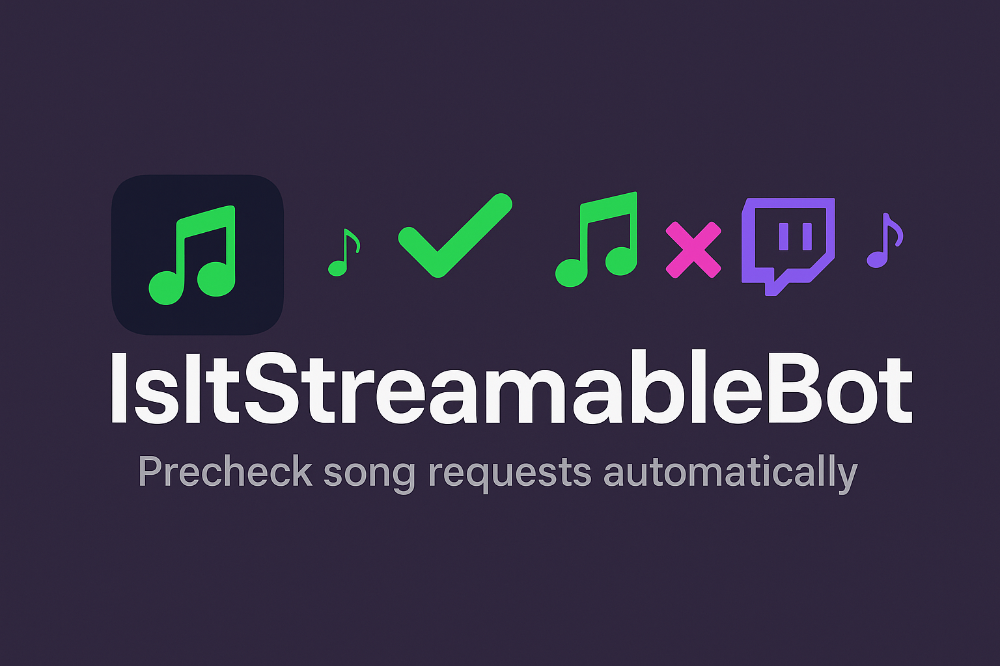
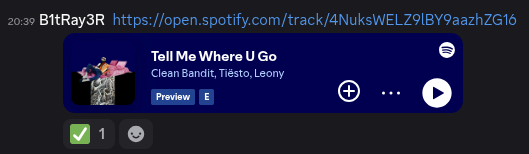
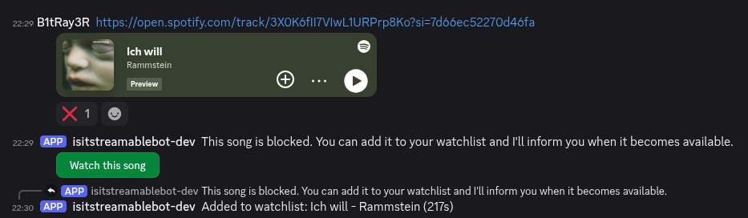
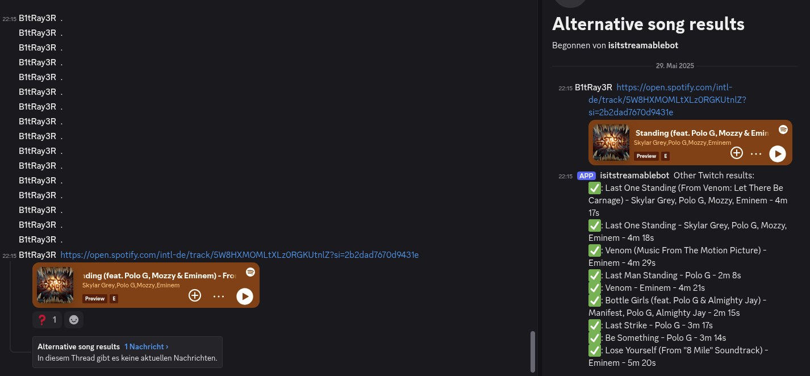

<p align="center">
  
</p>

# isitstreamablebot

[](https://golang.org/)
[](LICENSE)
[](https://hub.docker.com/r/aborgardt/isitstreamablebot)

isitstreamablebot is a Discord bot that checks if a song is streamable on Twitch DJ catalog. It supports Spotify track links and manual song queries, and allows users to maintain a watchlist for blocked songs. When a blocked song becomes available, the bot notifies users automatically.

---

## Table of Contents

- [Features](#features)
- [Screenshots](#screenshots)
- [Getting Started](#getting-started)
- [Quick Start](#quick-start)
- [Usage](#usage)
- [Configuration](#configuration)
- [Development](#development)
- [Planned Features](#planned-features)
- [Contributing](#contributing)
- [License](#license)
- [Acknowledgements](#acknowledgements)

---

## Features

- Check if a song is streamable on Twitch DJ catalog by providing a Spotify link or song title.
- Add blocked songs to a personal watchlist and get notified when they become available.
- List your current watchlist directly from Discord.
- Supports Discord slash commands and message-based interactions.

---

## Screenshots

<p align="center">
  
  
  
</p>

---

## Getting Started

### Prerequisites

- Go 1.24 or newer
- SQLite3
- Discord bot token
- Twitch Client ID
- Spotify API credentials

### Installation

1. Clone the repository:

    ```sh
    git clone https://github.com/b1tray3r/isitstreamablebot.git
    cd isitstreamablebot
    ```

2. Copy the example environment file and fill in your credentials:

    ```sh
    cp .env.template .env
    # Edit .env with your values
    ```

3. Install dependencies and generate code:

    ```sh
    make setup
    ```

4. Build the project:

    ```sh
    go build -o isitstreamablebot .
    ```

5. Start the bot:

    ```sh
    ./isitstreamablebot
    ```

> **Note:** Database migrations are executed automatically by the application on startup. There is no need to run migrations manually.

## Quick Start

You can use the prebuilt Docker image for a quick start:

```sh
docker pull ghcr.io/b1tray3r/isitstreamablebot:latest
docker run --env-file .env -v $(pwd)/data:/app/data ghcr.io/b1tray3r/isitstreamablebot:latest
```

Or build and run locally:

```sh
docker build -t isitstreamablebot .
docker run --env-file .env -v $(pwd)/data:/app/data isitstreamablebot
```

## Usage

- Send a Spotify track link in a whitelisted Discord channel to check its streamability.
- Use `/check` slash command to check a song by title and artist.
- Use `/watchlist` to view your current watchlist.
- Click the "Watch this song" button on blocked songs to add them to your watchlist.

## Configuration

All configuration is done via environment variables. See `.env.template` for required variables.

- `TWITCH_CLIENT_ID`
- `SPOTIFY_ID`
- `SPOTIFY_SECRET`
- `SPOTIFY_REDIRECT_URI`
- `DISCORD_BOT_TOKEN`
- `DISCORD_WHITELIST_GUILD_IDS`
- `DISCORD_WHITELIST_CHANNEL_IDS`

## Development

- Run tests with:

    ```sh
    go test ./...
    ```

- Code generation for SQL queries is handled by [sqlc](https://github.com/sqlc-dev/sqlc).
- Database migrations use [sql-migrate](https://github.com/rubenv/sql-migrate), but are triggered automatically by the application.

## Planned Features

- Periodically check the Twitch DJ catalog for updates on blocked songs and notify users when songs become available.

## Contributing

Contributions are welcome! Please open issues or pull requests. See [CONTRIBUTING.md](CONTRIBUTING.md) for guidelines.

## License

This project is licensed under the GNU General Public License v3.0. See [LICENSE](LICENSE) for details.

## Acknowledgements

- [discordgo](https://github.com/bwmarrin/discordgo)
- [sqlc](https://github.com/sqlc-dev/sqlc)
- [sql-migrate](https://github.com/rubenv/sql-migrate)
- [zmb3/spotify](https://github.com/zmb3/spotify)